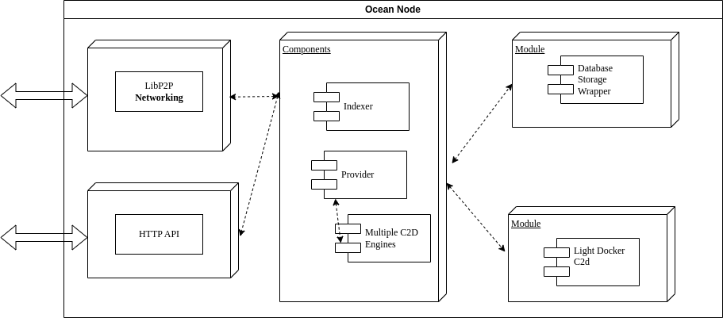

#  Ocean Node Architecture Overview

**Authors(s)**:
- [Alex Coseru](https://github.com/alexcos20)

**Maintainer(s)**:
- N/A

* * *

**Abstract**

This spec document defines the Ocean Node arhitecture, interfaces, layers, components,modules and how it all fits together.

Note, this document is not meant to be an introduction of the concepts in OceanProtocol and is not recommended as a first pass to understanding how Ocean works. For that, please refer to the [Docs](https://docs.oceanprotocol.com/).

# Table of Contents
- 1. Arhitecture Overview
- 2. Features
- 3. Nodes and Network Model
- 4. Components
- 5. Modules
- 6. P2P Messages & HTTP Endpoints

# 1. Arhitecture Overview

Node stack is divided in the following layers:
 - network layer  (libp2p & http api)
 - components layer (indexer, provider)
 - modules layer

Here is a quick overview: 

# 2. Features
- [libp2p supports ECDSA key pairs](https://github.com/libp2p/specs/blob/master/peer-ids/peer-ids.md#ecdsa), and node identity should be defined as public key
- multiple ways of storing URLS:
    - choose one node, use that private key to encrypt URL (enterprise approach)
    - choose several nodes, so your file(s) can be accessed even if one node goes down (given at least one node is still alive)
    - use MPC to have the key divided by multiple nodes (so no one has the entire key)
- protecting URL during download:  use a TEE enclave to decrypt the key (make sense only for MPC approach) and read content in the enclave
- should support multiple C2D Types:
    - light docker only  (for edge nodes)
    - Ocean C2D (k8)
- each component can be enabled/disabled on startup (Ie: start node without Indexer)

# 3. Nodes and Network Model
Nodes can receive user requests in two ways:
- HTTP API
- libp2p from another node
They are merged into a common object and passed to the right component.

Nodes should be able to forward requests between them if local database is missing objects.
(Example:   ALice wants to get DDO id #123 from Node A.  Node A checks local database. If the DDO is found, then it's send back to Alice.  If not, NodeA can query the network and grab the DDO from another node, who has it)

Nodes lip2p implementation:
 - should support core protocols (ping,identify,kad-dht (for peering), circuit relay for connections)
 - for Peer disover, we should support both mDNS & Kademlia DHT
 - all Ocean Nodes should subscribe to topic:  OceanProtocol. If any intresting messages are received, each Node is going to reply

# 4. Components & Modules

## 4.1 Indexer
An off-chain, multi-chain metadata & chain events cache. It continually monitors the chains for well known events and caches them.  (V4 equivalence: Aquarius)

Features:
  - monitors MetadataCreated & MetadataUpdated and stores DDO
  - validates DDO, according to multiple SHACL schemas
  - provides proof for valid DDOs
  - monitors datatokens contracts & stores orders
  - allows querys for all the above

## 4.2 Provider
- Performs checks on chain for buyer permissions and payments
- Encrypts the URL and metadata during publish
- Decrypts the URL when the dataset is downloaded or a compute job is started
- Encrypts/decrypts files before storage/while accessing
- Provides access to data assets by streaming data (and never the URL)
- Provides compute services (connects to multiple C2D engines (light, Ocean C2D, 3rd parties))

# 5. Modules

## 5.1 MPC
Instead of encrypting with private key, we can leverage MPC to construct the key

Used in encrypting & decrypting URL and file contents

## 5.2 TEE
Once a URL is decrypted (based on an consume requests), Node operator can log that URL and thus asset is compromised.

We can move the entire encryption/decryption/MPC process to TEE, thus giving us full security regarding plain data.

A Node that supports TEE should expose it's proof in the status endpoint. 

With MPC encryption (both assets & files), other nodes should refuse to assemble the private key back if the node does not expose & passes the proof check

## 5.3 Database Storage Wrapper
TBD

## 5.4 Light Docker C2D
Ocean C2D is flexible, scalable, etc, but if has one major drawback: it requires K8.
For edge nodes (ie: installed in a car, or a weather station running on RaspPI), we can have a light engine, that is only using the docker system install on the host.  All orchestration (creating & provisioning input volumes, publishing results) can be handled by this module, while only the actual algorithm job is levereged to docker, with local provisioned folders mounted)

# 6. P2P Messages & HTTP Endpoints

